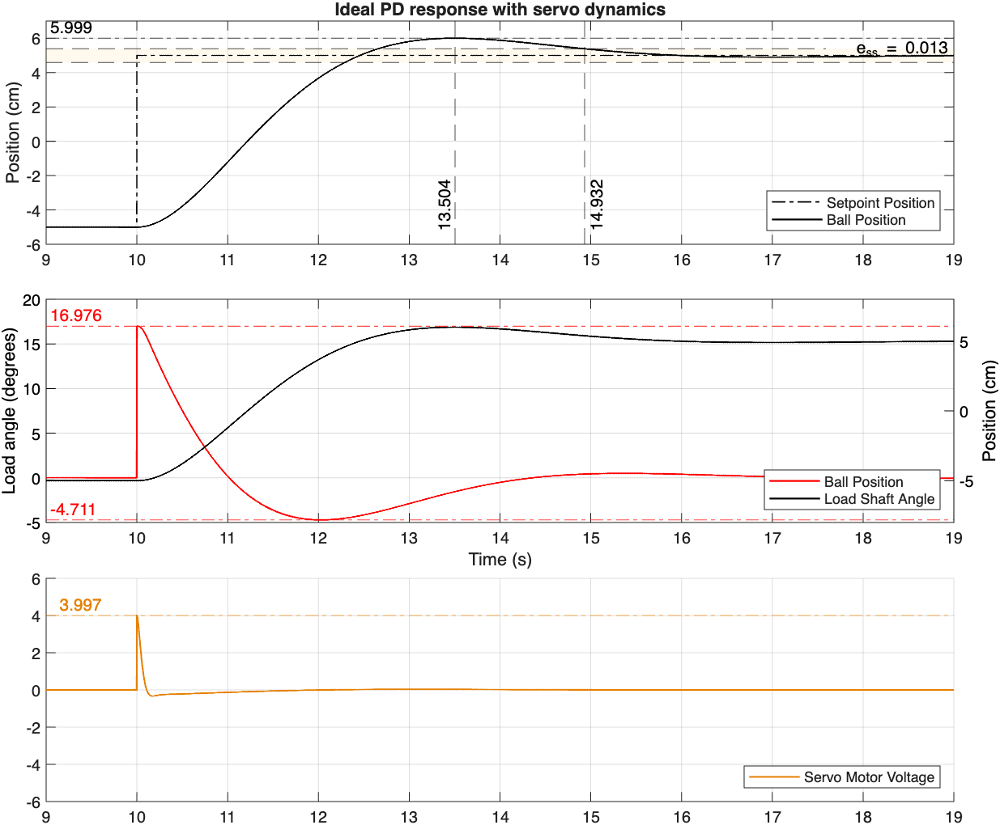

# Ball and Beam Experiment

## Specifications
$$
\begin{align*}
e_{ss} &\leq 0.005 \text{ metres} \\
t_s &= 4.9 \text{ seconds}\\
PO &= 10.0%
\end{align*}
$$

## MATLAB Code
```
plot_position_theta(start_time, end_time, x_matfile, theta_matfile, vm_matfile)
```
- `start_time` (seconds): required, set to negative to get full range
- `end_time` (seconds): required, ignored if start_time < 0.0
- `x_matfile`: required, path to position data MAT file
- `theta_matfile`: optional, path to angle data MAT file
- `vm_matfile`: optional, path to voltage data MAT file

Titles are not set by default and should be added manually to the figure.


